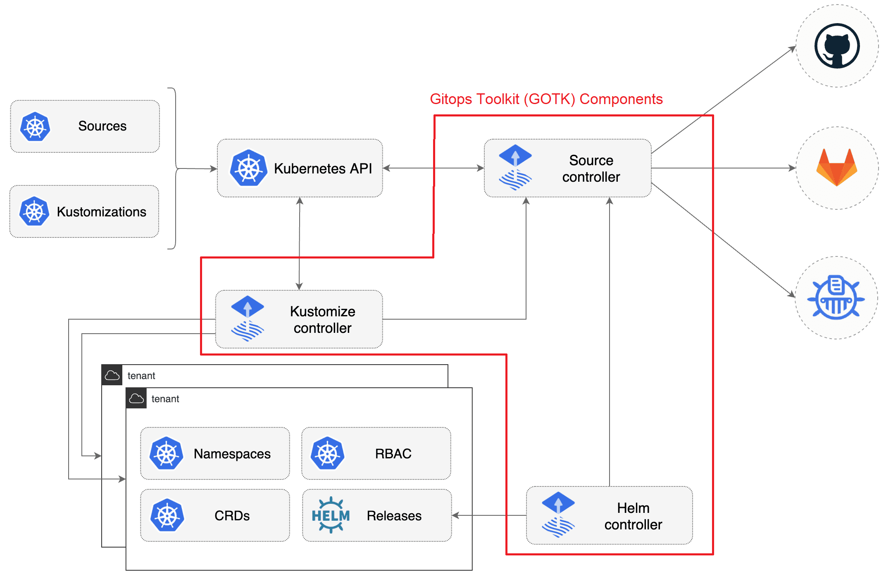

# Flux v2 and the GitOps Toolkit

## [Flux v2](https://github.com/fluxcd/flux2)

- Supports the same workflows as Flux v1, with more flexibility and using Kubernetes-native components.
- Existing Flux and Flux/Helm users are supported and migration is well supported.

### getting_started.sh

- Based on: [Get Started With Flux v2 Tutorial](https://toolkit.fluxcd.io/get-started/)
- Requirements:
  - export GITHUB_USER=<github_username>
  - export GITHUB_TOKEN=<public_access_token>
  - The [personal access token](https://help.github.com/en/github/authenticating-to-github/creating-a-personal-access-token-for-the-command-line) needs to create repositories (check all permissions under repo).
  - [Azure CLI](https://docs.microsoft.com/en-us/cli/azure/install-azure-cli)
  - Azure Login and subscription
  - A bash terminal
- What this script does:
  1. Installs flux
  2. Logs in to Azure CLI
  3. Creates a resource group and 2 AKS clusters
  4. Executes the staging bootstrap and workflow
  5. Executes the production bootstrap and workflow

### Resources

- [Flux v1 to v2 Migration Guide](https://toolkit.fluxcd.io/guides/flux-v1-migration/)
- [FAQ on Flux v2](https://github.com/fluxcd/flux2/blob/main/docs/faq/index.md), including key differences from v1.
- [Flux v2 Roadmap](https://toolkit.fluxcd.io/roadmap/)
- [Migrate from the Helm Operator to the Helm Controller](https://toolkit.fluxcd.io/guides/helm-operator-migration/)

## [GitOps Toolkit (GOTK)](https://github.com/fluxcd/flux2#gitops-toolkit)

- GOTK is a set of composable APIs and specialized tools that can be used to build a CI/CD platform on top of Kubernetes.
- Users can make their own workflows using the components.
- Third parties can extend GOTK with new components.
